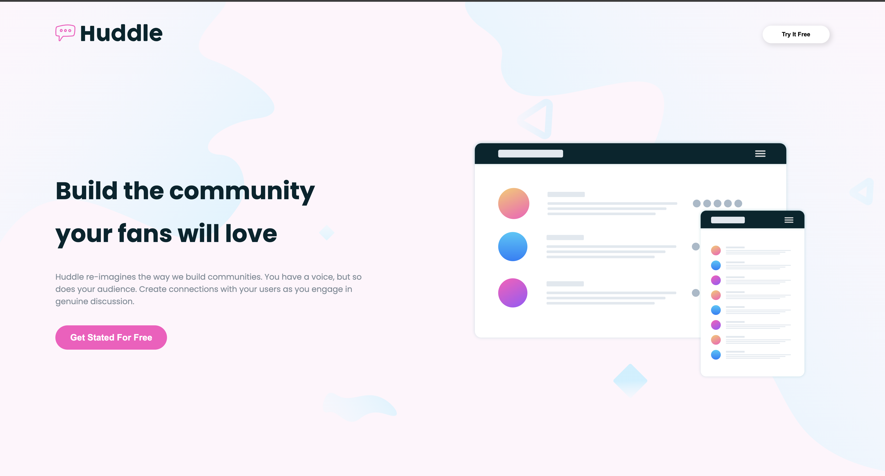
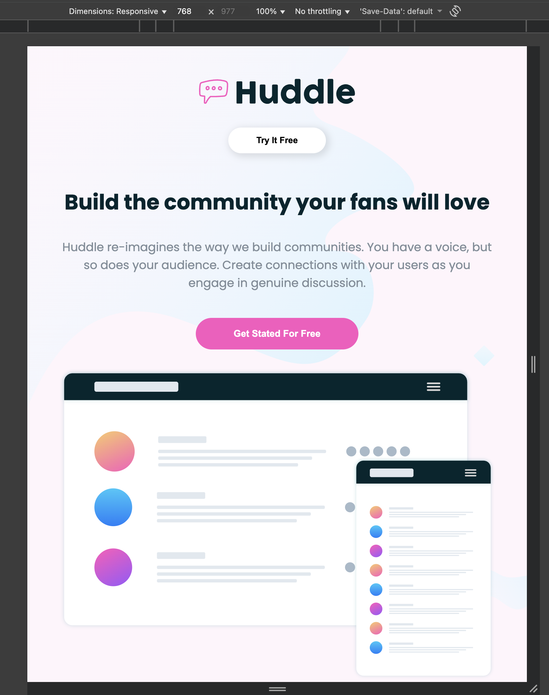
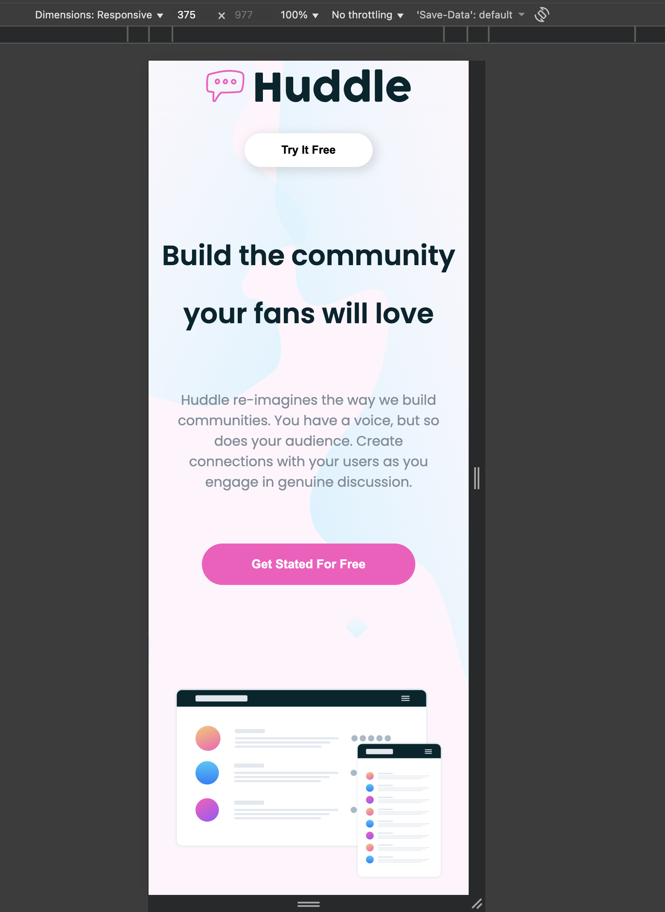

#  Huddle Landing Page

##  Description

Ce projet consiste à réaliser une page de  plateforme fictive Huddle.  
L’objectif est de mettre en pratique les compétences en HTML et CSS acquises lors de la formation, en créant une page web moderne, responsive et attrayante.

### Objectifs pédagogiques

- Structurer le contenu avec des balises HTML sémantiques
- Mettre en forme la page grâce au CSS  
- Intégrer des images, icônes et logos
- Rendre la page responsive pour une expérience optimale sur tous les appareils  
- Créer une navigation claire et un pied de page complet.

##  Objectifs du projet

-  Structurer une page web complète  
-  Utiliser des images et des icônes  
-  Maîtriser la mise en forme avec CSS

##  Spécifications 

-  Structure HTML
-  Utilisation correcte des polices Google Fonts   
-  Respect de la palette de couleurs
-  Page responsive grâce à Flexbox et media queries.
-  Code propre et bien organisé
-  Bonne et accessible a tous les écrans .

## Technologies utilisées

- HTML
- CSS
- Google Fonts
- Remix Icons

## Remarques
 Ce projet m’a beaucoup aidée a approfondir et à améliorer mes compétences en HTML et CSS. 
 J’ai pris plaisir à le réaliser et à voir le résultat final prendre forme.

## desktop

## tablette

## mobile
